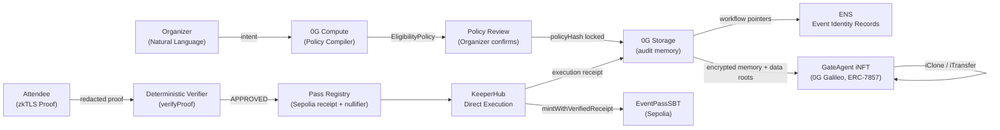

# VeriGate

Private RSVP gates with zkTLS eligibility proofs, 0G audit memory, KeeperHub pass execution, ENS event identity, and a real GateAgent iNFT on 0G Galileo.

Demo video: https://youtu.be/jV2zf1njsjg

GitHub: https://github.com/Skottbie/VeriGate

Contact: X https://x.com/eazimonizone / Telegram @UnlockeRrrr

## What It Does

VeriGate lets an event organizer create a private access gate, for example "qualified ETH holder," without asking attendees to reveal their source wallet or exact balance.

The workflow is:

1. Organizer describes the event and eligibility requirement.
2. 0G Compute compiles the organizer intent into a structured policy.
3. Attendee proves eligibility with zkTLS.
4. The backend verifies the zkTLS attestation server-side and redacts private proof material.
5. A deterministic verifier approves or rejects the redacted applicant proof.
6. 0G Storage anchors policy, proof metadata, audit memory, execution planning, and workflow manifests.
7. KeeperHub executes a receipt-gated RSVP pass mint to a fresh browser-generated recipient wallet.
8. ENS publishes event identity records that point to the verified workflow.
9. A GateAgent iNFT is minted on 0G Galileo with encrypted event intelligence and verifier-checked iClone/iTransfer updates.

The frontend exposes a dual-role RSVP Studio:

- Organizer: create a private gate, review policy, inspect pseudonymous applications, publish ENS records, and activate GateAgent.
- Attendee: connect source wallet locally, sign a control message, generate a zkTLS proof, verify eligibility, generate a fresh pass wallet, and claim an RSVP pass.
- Onchain Records rail: external verification links for 0G Storage submissions, pass transactions, ENS publish transactions, and GateAgent iNFT records.

## Architecture



## Sponsor Integrations

### 0G

VeriGate uses 0G as the canonical compute, storage, and agent memory layer.

- 0G Compute compiles organizer intent into policy JSON and returns a compute receipt.
- 0G Storage stores compact workflow bundles, proof metadata, audit records, pass execution memory, and GateAgent encrypted metadata.
- 0G Galileo hosts the GateAgent iNFT and data verifier contracts.
- The GateAgent iNFT embeds encrypted intelligence through 0G Storage pointers and onchain data roots.

### ENS

VeriGate uses ENS as the public identity layer for the agent and each event. The agent ENS name is `verigate-agent.eth` (Sepolia). Event subnames are derived from the active gate identifier.

- ENS text records include policy hash, verifier address, pass contract, audit pointer, app URL, proof hash, and nullifier.
- The UI publishes records, resolves them back, and checks alignment against the current workflow result.
- Records can be verified at: https://app.ens.domains/verigate-agent.eth

### KeeperHub

VeriGate uses KeeperHub Direct Execution for the reliable pass mint step.

- KeeperHub calls the pass contract's `mintWithVerifiedReceipt(recipient, receiptId, tokenURI)` function.
- The pass contract requires a valid verifier receipt and consumes the nullifier before minting.
- The source ETH holder wallet is never used as the pass recipient. A fresh recipient wallet is generated locally in the browser.
- KeeperHub execution id, transaction hash, transaction link, and receipt binding are written back into 0G Storage.

KeeperHub currently targets the Sepolia pass deployment because KeeperHub Direct Execution supports Sepolia for this integration. 0G remains the compute, storage, audit, and GateAgent layer.

Builder feedback: `docs/keeperhub-builder-feedback.md`

## Live Deployments

### 0G Galileo

Deployment file: `deployments/0g-galileo/addresses.json`

| Contract | Address | Explorer |
| --- | --- | --- |
| EventRegistry | `0x1773fC52D7C64e3AF5C7dad31a28dF999d646f69` | https://chainscan-galileo.0g.ai/address/0x1773fC52D7C64e3AF5C7dad31a28dF999d646f69 |
| NullifierRegistry | `0x9D1D4d7c17E87679a27778B2Ba9c3034B94b0788` | https://chainscan-galileo.0g.ai/address/0x9D1D4d7c17E87679a27778B2Ba9c3034B94b0788 |
| VerifierReceiptRegistry | `0xBC5d68c48014d9C8809a9dF34B03839c8a2A6De7` | https://chainscan-galileo.0g.ai/address/0xBC5d68c48014d9C8809a9dF34B03839c8a2A6De7 |
| EventPassSBT | `0xC6E45721b7CD58e1FE301870DeE9614DFC1Dc120` | https://chainscan-galileo.0g.ai/address/0xC6E45721b7CD58e1FE301870DeE9614DFC1Dc120 |
| GateAgentDataVerifier | `0xEAD5F31be0595C79CE56C25cCb7F39f1c4dF1Bf2` | https://chainscan-galileo.0g.ai/address/0xEAD5F31be0595C79CE56C25cCb7F39f1c4dF1Bf2 |
| GateAgentINFT | `0xcD6c201A59F97291dabD45DA1456798D142F9f5e` | https://chainscan-galileo.0g.ai/address/0xcD6c201A59F97291dabD45DA1456798D142F9f5e |

### Sepolia KeeperHub Execution Target

Deployment file: `deployments/sepolia/addresses.json`

| Contract | Address |
| --- | --- |
| EventRegistry | `0xc233c7cDCD2B9D5827beb5FafEf6B67752B2c34f` |
| NullifierRegistry | `0x02741144c59870aD1CFa51b5D0b6dd97D27aabac` |
| VerifierReceiptRegistry | `0x9aB41705c802C426dBdcFE377F5A96e76F4c51cb` |
| EventPassSBT | `0xb283e3D15538529cf7D250663a4436695e8C928e` |

## GateAgent iNFT Proof

Live artifact: `deployments/0g-galileo/gate-agent-live-result.json`

- GateAgentINFT token #1: https://chainscan-galileo.0g.ai/token/0xcD6c201A59F97291dabD45DA1456798D142F9f5e
- Mint tx: https://chainscan-galileo.0g.ai/tx/0x4e9b60f357a5fb3655e3ec1d4c7259848095fd6c5cc7ade4a7741d37c60fa30f
- iClone tx: https://chainscan-galileo.0g.ai/tx/0xf80aebe2492af84c4e19dc5805770951edbb2995c1723f8fe2ab3875de8e2690
- iTransfer tx: https://chainscan-galileo.0g.ai/tx/0x0d2957c2deb310d40467d3b2c4b59a027c147e0ba889bd7b48622769d585f6a0
- Minted encrypted metadata root: `0x2432176e14f3182645ff9fcc4e6502a7c6ec05d3e58ae559abdec9932f29bac4`
- Minted data root: `0xfc48322d7306463bb5269b92c41c6286602c2546d9383fa4887c0927d8f7c47c`

The metadata plaintext is intentionally withheld. The public artifact proves that encrypted GateAgent intelligence is embedded via 0G Storage pointer plus onchain data root.

## Recorded Demo Run

The demo video uses the same live workflow and exposes these third-party verification records:

- KeeperHub RSVP pass tx on Sepolia: https://sepolia.etherscan.io/tx/0x255887ca7c9e8c18c5f5df3c45eb3c2d9bcb23c3b75131e38acaa48a3006ee8a
- ENS publish tx on Sepolia: https://sepolia.etherscan.io/tx/0x58743fc9219a528bd084c20c7753da15912fbc2866b8c0ccab0f049e3603d4fa
- Demo GateAgent mint tx on 0G Galileo: https://chainscan-galileo.0g.ai/tx/0x9035ef8660ecc65426d852ac24c5210d66befb69e957686362007bd5ab30cc53
- Demo GateAgent iTransfer tx on 0G Galileo: https://chainscan-galileo.0g.ai/tx/0x3382e832328df0d7b1cbed98e1e22bafeeffa4748956aff559d097f7637de298

## 0G Storage Proofs

Live artifact: `deployments/0g-galileo/storage-pointers.json`

Example Open Agents demo namespace: `verigate/events/open-agents-demo-gate`

- Policy tx: https://chainscan-galileo.0g.ai/tx/0xdc170a94e003d82b84775929139aaf418fe46bd44a4beb45eb71d8546c889ba2
- Compute receipt tx: https://chainscan-galileo.0g.ai/tx/0x5d00f8ce743251ac2675740a4fa4ec6281f2b5a8d035c9db9ad4111b4f793224
- Audit tx: https://chainscan-galileo.0g.ai/tx/0xe7eab359c2745bd816eaacb3fc7fc846bf5ec300adda62881c483414db27eef7
- Execution plan tx: https://chainscan-galileo.0g.ai/tx/0xee679e54bdf8d648b88606a56f0ec86a83430a78b64168ff59ad96ec3eddd132
- Manifest tx: https://chainscan-galileo.0g.ai/tx/0xe70f270918b4b30388a051332803c1d4164193e160b0197433858f5b44fb3c63

## Setup

Requirements:

- Node.js 20+
- npm
- 0G Galileo testnet account
- Sepolia account for KeeperHub-supported pass execution
- Reclaim app credentials for live zkTLS proof generation
- KeeperHub API key for live pass execution

Install dependencies:

```bash
npm install
```

Copy environment template:

```bash
cp .env.example .env
```

Fill the values in `.env`. Never commit real secrets.

Run tests:

```bash
npm test
```

Run the RSVP Studio:

```bash
npm run dev:web
```

Open:

```text
http://localhost:4173
```

## Useful Commands

```bash
npm run compile
npm run test:reclaim
npm run test:keeperhub
npm run test:gate-agent
npm run dev:web
```

Live-only commands require `.env` credentials:

```bash
npm run test:reclaim:live
npm run test:ens:live
npm run test:gate-agent:live
```

## Privacy Boundary

Public records include hashes, commitments, nullifiers, redacted proof metadata, execution receipts, ENS records, and encrypted metadata pointers.

Withheld by design:

- source wallet plaintext
- wallet signature
- raw zkTLS proof
- exact ETH balance
- request headers/body
- GateAgent metadata encryption key
- policy intelligence plaintext

## Team

Solo founder/builder: Skottbie

- X: https://x.com/eazimonizone
- Telegram: @UnlockeRrrr
